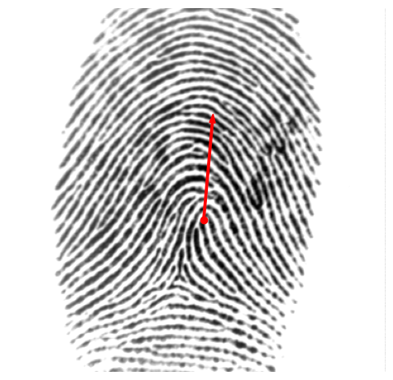

# Fingerprint 2D pose estimation
Estimating Fingerprint Pose via Dense Voting

## Requirements
pytorch==1.10.0, numpy==1.21.4, scipy==1.7.3, imageio==2.13.3, opencv==3.4.2.17, PyYaml==6.0, Pillow==8.4.0

## Deploy
1. download the [trained model](https://cloud.tsinghua.edu.cn/f/685981cc0d2f4d48ad41/?dl=1) and unzip it
2. place the model in the folder [./logs](./logs)
3. according to your image location, adjust the related parameters `prefix` in the file [./deploy_gridnet.py](./deploy_gridnet.py)
4. run `python deploy_gridnet.py -i <img_name.img_format>`
